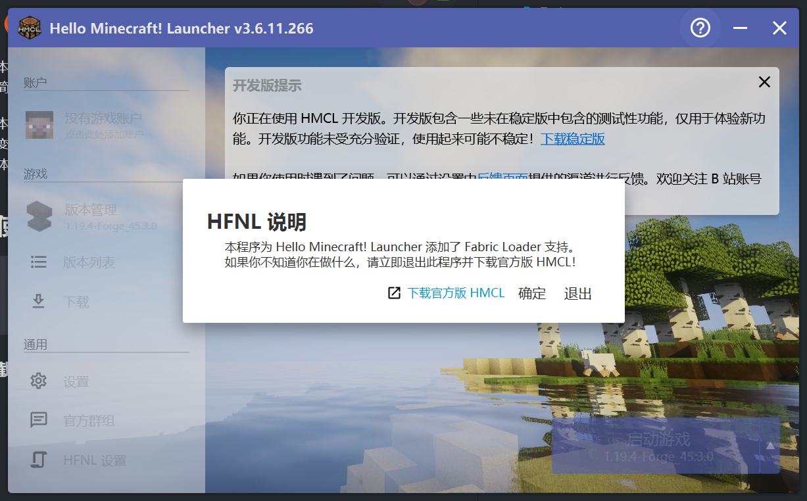
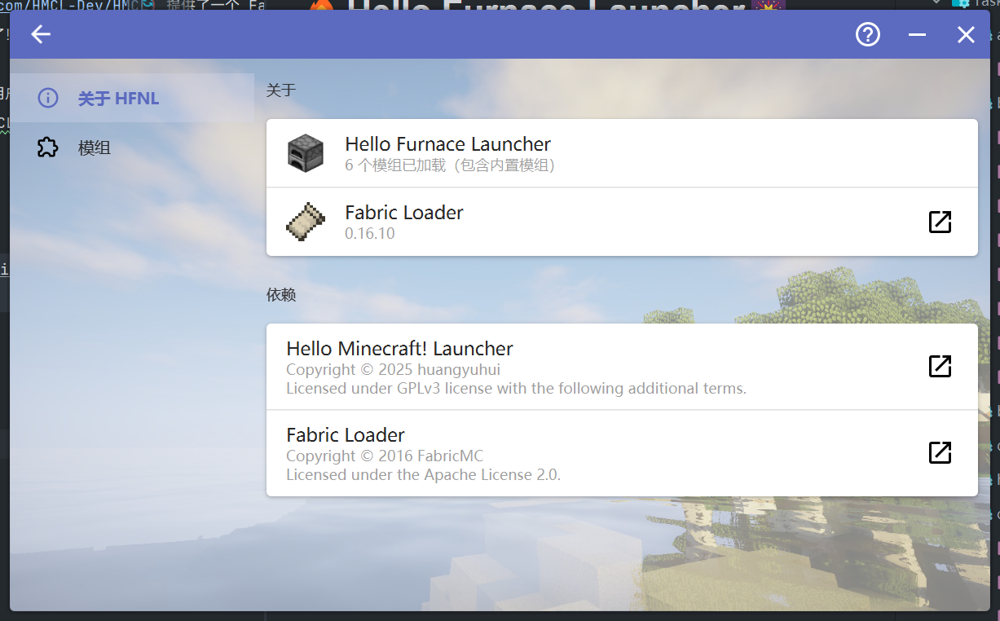
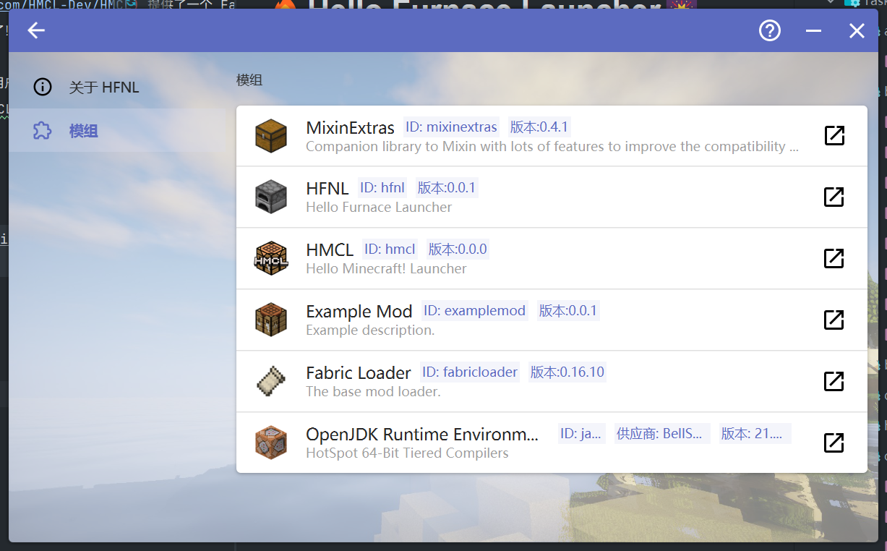

# 🔥Hello Furnace Launcher🎆
**随便搞的，估计不会怎么更新了**

本项目为 [HMCL](https://github.com/HMCL-Dev/HMCL) 提供了一个 FabricLoader GameProvider 以及一个内置 Mod。
简而言之，你可以在 HMCL 上安装模组了！

本项目不包括 HMCL 本体，使用时需要用户自行下载 HMCL 并添加到 Java 系统变量 `fabric.gameJarPath` 中。
在开发环境时会自动从 maven 下载 HMCL 本体并添加到上述变量中。

## 使用

```shell
git clone https://github.com/ciilu/HFNL.git
cd HFNL
./gradlew run
```

### 截图


